# Victor Garcia Cantalapidera 
-Slack:[@Victor Garcia](https://code-institute-room.slack.com/team/U0695HZA7FZ)

-GitHub: [Vgarcan](https://github.com/Vgarcan)

-LinkedIn: [Victor Garcia](https://www.linkedin.com/in/vgc89/)

## Check us out!

[Visit our Website - DreamsReader](https://ambitious-bush-0d5afce1e.4.azurestaticapps.net/) \***Recommended*\**

[DreamsReader GitHub Pages](https://ambitious-bush-0d5afce1e.4.azurestaticapps.net/) 


## Table of Contents

1. [Introduction](#introduction)
2. [Technologies Used](#technologies-used)
3. [Project Structure](#project-structure)
   - [Main Pages](#main-pages)
   - [Additional Pages (Mockups)](#additional-pages-mockups)
   - [CSS Management for Project Structure](#css-management-for-project-structure)
   - [Colors](#colors)
4. [User Experience](#user-experience)
5. [Testing](#testing)
    - [HTML Validation](#html-validation)
    - [CSS Validation](#css-validation)
    - [Accessibility](#accessibility)
    - [Wave Validation](#wave-validation)
    - [Lighthouse Validation](#lighthouse-validation)
    - [Device testing](#device-testing)
    - [Browser Compatibility](#browser-compatibility)
   - [User Stories Testing](#user-stories-testing)
6. [Collaborative Efforts](#collaborative-efforts)
7. [Current State and Future Plans](#current-state-and-future-plans)
   - [Current State](#current-state)
   - [Future Plans](#future-plans)
8. [Deployment](#deployment)
9. [License](#license)
10. [Bugs and Challenges](#bugs-and-challenges)
11. [Acknowledgment](#acknowledgment)


# Introduction


- **Project Overview:**
This is an ongoing endeavor to create a platform that allows users to explore and share their dreams. The project is currently in the example stage, serving as a demonstration of what it will become in the future.


- **Purpose:**
The purpose of this project is to provide users with a platform where they can document, explore, and share their dreams. The Dream Reader aims to create a visually appealing and user-friendly space for dream enthusiasts.


- **Goals:**
1. **Educational Example:** The project is currently serving as an example to showcase its potential features and functionality.
2. **Free Access:** While access is limited during the example phase, the goal is to offer free access to users in the future.
3. **Comprehensive Dream Database:** Establishing a robust and diverse dream database is a key goal. This involves collecting a wide range of dream entries from users to ensure the AI interpreters gain insights into various dream patterns and specifics. The aim is to build a foundation for effective dream interpretation across different demographics, enhancing the platform's capability to provide accurate and personalized dream insights for users from all walks of life.


# Technologies Used

The Dream Reader Project leverages the following technologies to create a responsive and visually appealing platform:

- **HTML:** The foundation of the project's structure.
- **CSS:** Styling to enhance the visual experience.
- **Bootstrap:** Utilized for responsive design and consistent styling across different pages.

# Project Structure

The content of the Dream Reader Project is organized across different main pages, each meticulously designed to fulfill specific purposes while maintaining a consistent user interface. Below, you'll find an overview of each main page, highlighting the rationale behind its design.

## Main Pages

1. **Index (Home):**
   <details><summary><b>Basic Structure</b></summary>
   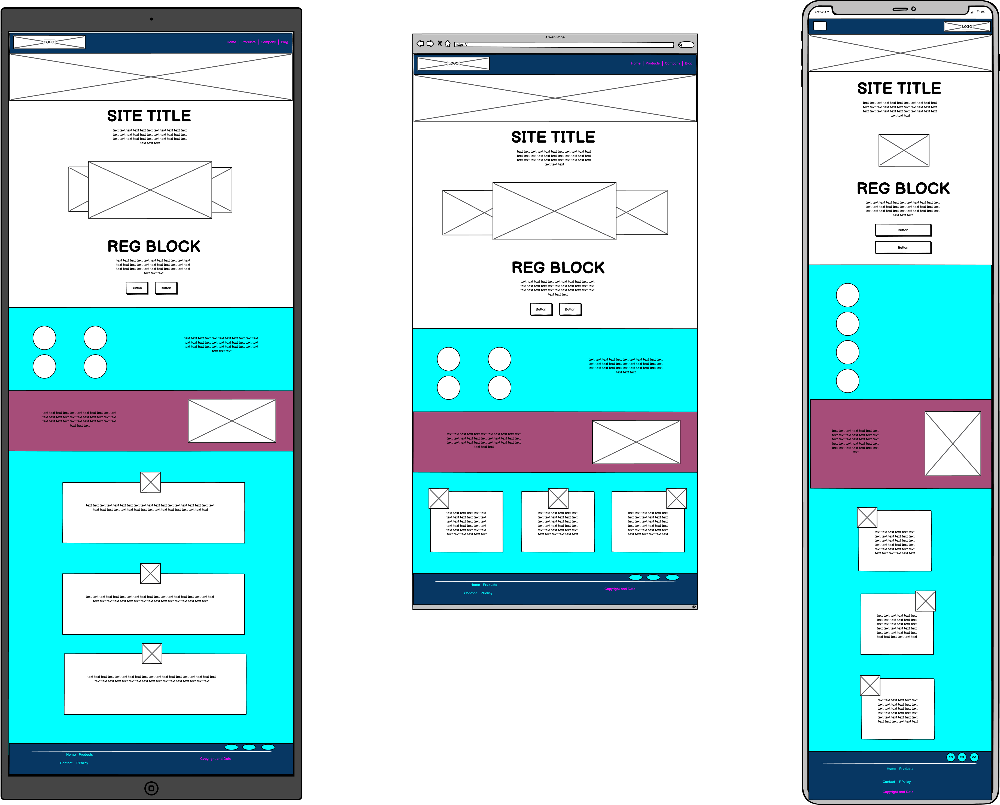</details>
   <hr>

   - *Purpose:* To introduce users to the project, provide general information, and encourage user registration.
   - *Design:* The page features a welcoming layout with essential project details, a call-to-action for user engagement, and clear navigation to other sections. The goal is to create a hub where users can learn about the project and its features.
   

   
2. **Diary Example:**
   <details><summary><b>Basic Structure</b></summary>
   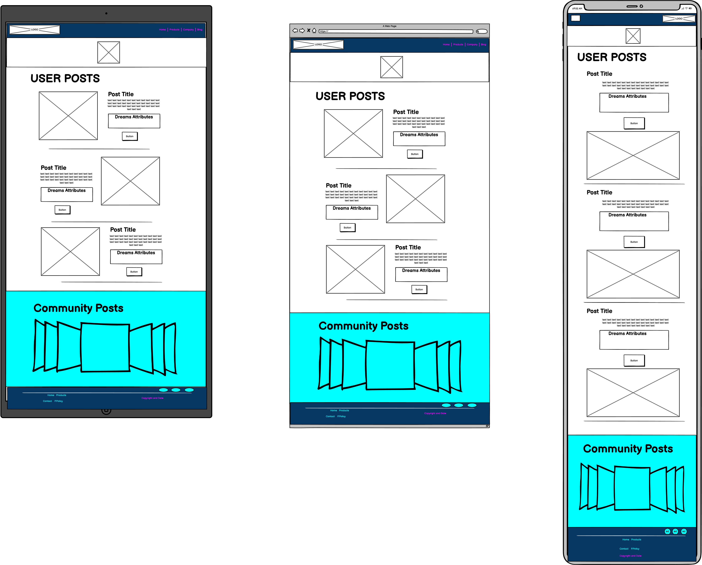</details>
   <hr>
   
   - *Purpose:* To demonstrate how a user's dream diary might look, showcasing dream entries, AI-generated attributes, and community posts.
   - *Design:* The page is structured like a typical dream diary, featuring dream entries with titles, dates, explanations, and AI-generated attributes. The community posts section is presented as a slider, encouraging users to explore and engage with shared dreams.

3. **Contact Us:**
   <details><summary><b>Basic Structure</b></summary>
   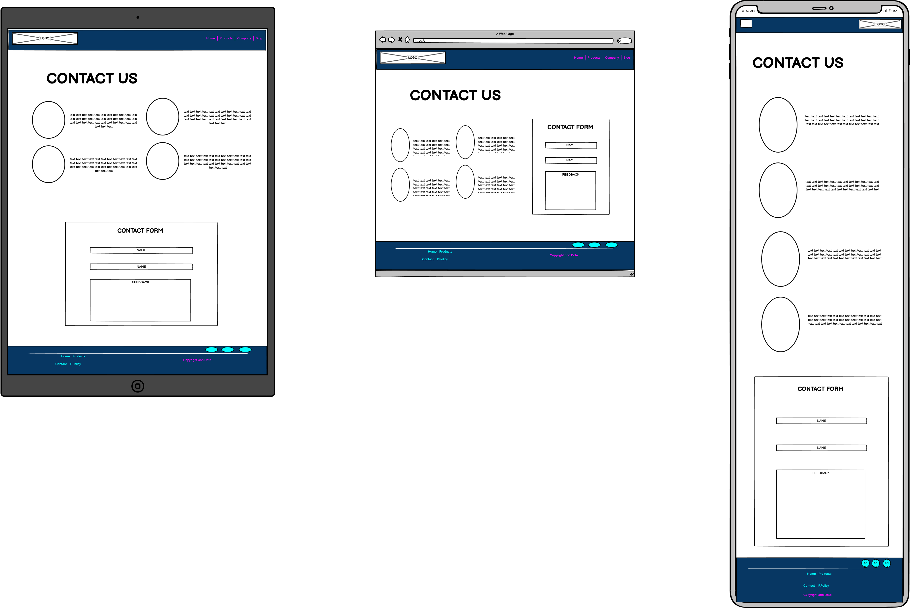</details>
   <hr>
   
   - *Purpose:* To allow users to reach out for support, collaboration, or general feedback.
   - *Design:* The page is designed as a single section, focusing on simplicity and user-friendly communication. It includes information on why users might want to contact the project, presented with icons for visual appeal. Includes a user-friendly form for easy communication.

## Additional Pages (Mockups)

- **Press:**
  - *Purpose:* To showcase potential press coverage in the future.
  - *Design:* The page is a mockup designed to visually represent how press coverage might look. It serves as a placeholder for future achievements and features, enhancing the project's credibility.

- **404 Error:**
  - *Purpose:* To inform users about non-existent links during development.
  - *Design:* The page provides a friendly error message, explaining that the requested page is under development. It features a link back to the index, ensuring users can easily navigate back to the main page.

- **Privacy Policy:**
  - *Purpose:* To outline the project's privacy policies, even in mockup form.
  - *Design:* The page is designed to mimic a privacy policy page, emphasizing the importance of responsible data handling. While currently a mockup, it hints at the future inclusion of comprehensive privacy policies.

The thoughtful design of each page is aimed at creating an engaging and informative user experience, ensuring that users can easily navigate the platform and understand its different facets.

## CSS Management for Project Structure

The CSS for the project structure is organized to maintain consistency and responsiveness across all pages. Key strategies include:

1. **Global Styles:**
   - Shared styles, such as fonts, colors, and spacing, are defined in a global stylesheet. This ensures a cohesive look and feel across all pages.

2. **Responsive Design:**
   - Media queries are employed to adjust styles based on the device's screen size. This guarantees an optimal viewing experience on various devices, from desktops to mobile phones.

3. **Class-Based Styling:**
   - Classes are used to apply consistent styling to elements shared across different pages, like navigation bars and footers. This simplifies maintenance and ensures uniformity.

4. **Specific Page Styles:**
   - Each main page has its own stylesheet, focusing on specific styles relevant to that page. This allows for targeted customization while maintaining a cohesive overall design.

By adopting these strategies, the CSS management ensures a visually pleasing and user-friendly interface while accommodating the unique characteristics of each page.

## Colors

The color scheme has been thoughtfully curated to evoke a dreamlike experience for users. Specific color choices aim to create a nocturnal ambiance, enhancing the overall theme of dreams. 

- **Blues for Nighttime Ambiance:**
  - Tonalities of blue are employed in the navigation bar and footer, contributing to a nighttime environment. This choice aims to immerse users in a dreamy atmosphere as they navigate through the platform.

- **Strategic Use of Pink:**
  - Pink is strategically used to draw attention to key elements. For instance, the "Register for Free" call-to-action features pink text, emphasizing its importance. The pink color is also applied to elements related to the dream diary, capturing the user's focus and adding a playful touch to the interface.

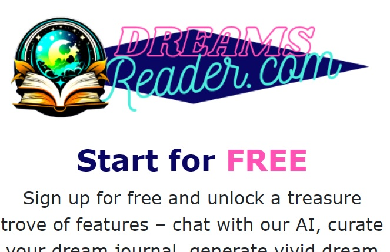</details>

- **Contrast with Black Text:**
  - Black text is predominantly used for readability. However, when emphasis is required, such as in the "Free" button or diary sections, pink is introduced to create visual contrast.

- **Dreamlike White and Pastels:**
  - The first section is predominantly white, evoking a dreamy and ethereal quality. The use of whites aims to convey an otherworldly, dream-like aesthetic. In contrast, the second section features soft pastel blues, creating a harmonious blend with pink, contributing to an innocent and playful overall design.

  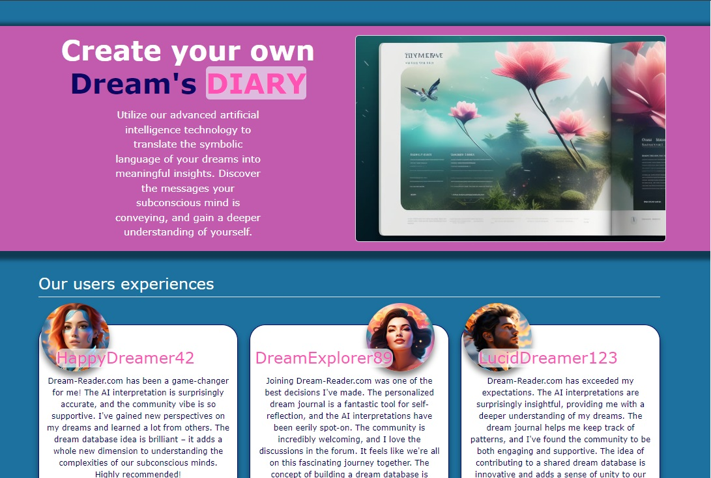</details>


The careful selection and combination of colors aim to foster a sense of exploration reminiscent of childhood innocence, inviting users to engage with the platform as if embarking on a whimsical adventure.


# User Experience

## Target Audience
Dream enthusiasts exploring a platform to document, explore, and share their dreams.
Individuals intrigued by the world of dreams, interested in the interpretation and analysis of dream content.
Collaborators and contributors passionate about the intersection of artificial intelligence and dream exploration.
Users with dream-related content, stories, or experiences they want to share with the community.

## User Requirements and Expectations
1. **Intuitive Navigation:**
   - Users expect a simple, smart, and intuitive navigation system to explore different sections of the Dream Reader platform.

2. **Functional Links:**
   - The platform must provide links and functions that work seamlessly, allowing users to navigate between pages, access dream entries, and engage with the community.

3. **Visually Appealing Design:**
   - Users anticipate a visually appealing and responsive website that enhances the dream exploration experience.

4. **Contact Information:**
   - All necessary contact information should be easily accessible, providing users with the means to reach out for support, collaboration, or general feedback.

5. **Accessibility:**
   - The platform should maintain a good level of accessibility, ensuring that users of all abilities can engage with and enjoy the Dream Reader experience.

## User Stories

### First-time User
- **Introduction Clarity:**
  - As a first-time user, I want a clear and concise introduction to understand the purpose and offerings of the Dream Reader platform.

- **User-Friendly Navigation:**
  - As a first-time user, I expect an easy-to-navigate website that allows me to explore dream entries, understand the platform's features, and recognize its unique value.

- **Engaging Content:**
  - As a first-time user, I want to quickly assess if the platform aligns with my interests in documenting and exploring dreams.

- **Value Proposition:**
  - As a first-time user, I look for elements that highlight the unique value and experience offered by Dream Reader in comparison to other platforms.

### Returning User

- **Contact Details:**
  - As a returning user, I need easily accessible contact details such as contact form to connect with Dream Reader for inquiries.

- **Discover New Content:**
  - As a returning user, I aim to explore new dream entries, features, or community posts on the platform.

- **Social Media Presence:**
  - As a returning user, I seek links to Dream Reader's presence on social media platforms for updates and community engagement.

- **Interaction Opportunities:**
  - As a returning user, I want to engage with the community and staff, especially if I have dream-related content to share or contribute.

### Site Owner
- **Mission Communication:**
  - As the site owner, I aim to communicate the mission of Dream Reader swiftly and effectively to users.

- **Value Proposition Clarity:**
  - As the site owner, I want users to understand the specific value of Dream Reader in the realm of dream exploration.

- **Advocacy for Dream Exploration:**
  - As the site owner, I strive to spread awareness about the value of exploring dreams, both from an individual and collective perspective.

- **Item Acquisition:**
  - As the site owner, my goal is to acquire more dream-related content and contributions to enhance the Dream Reader platform.

- **User Accessibility:**
  - As the site owner, I want to ensure that users can easily reach out to Dream Reader through accessible contact options.

- **AI Interpretation Focus:**
  - As the site owner, my goal is to ensure that the AI system  for dream interpretation remains focused on its intended purpose.


# Testing

## HTML Validation
The HTML code has been validated using the W3C Markup Validation Service ([W3C Validator](https://validator.w3.org/)). This ensures that the HTML adheres to the appropriate standards, enhancing compatibility and minimizing potential issues.

<details><summary><b>INDEX Validation</b></summary>
   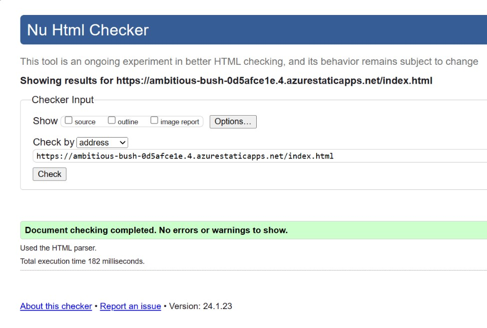</details>
   <hr>
<details><summary><b>DIARY Validation</b></summary>
   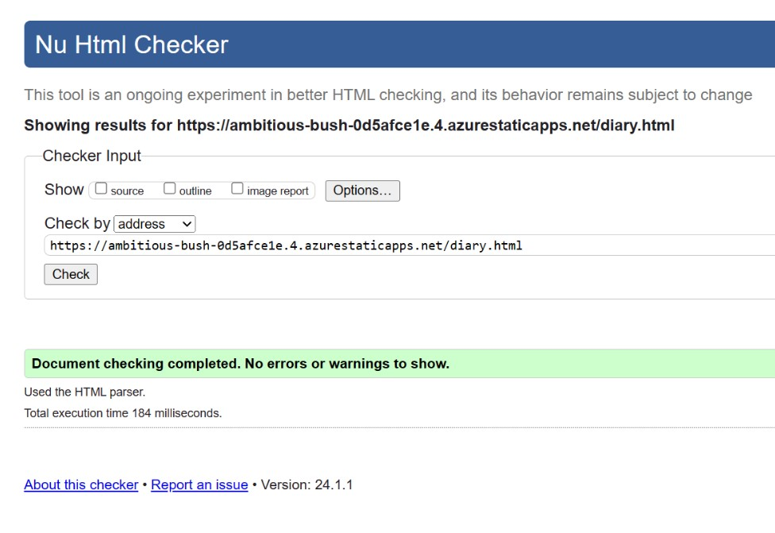</details>
   <hr>
   <!--! Change img  -->
<details><summary><b>CONTACT US Validation</b></summary>
   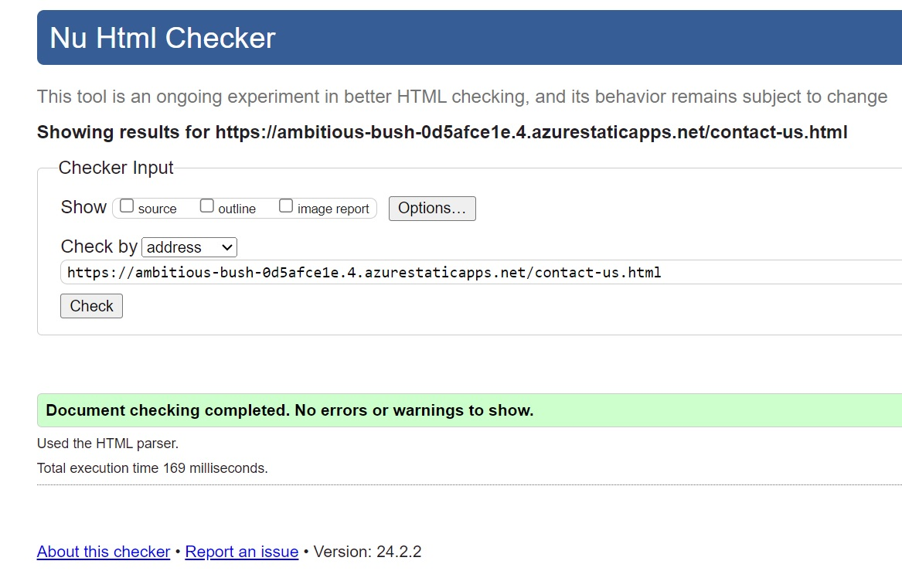</details>
   <hr>

## CSS Validation
CSS code has been validated using the W3C CSS Validation Service ([W3C CSS Validator](https://jigsaw.w3.org/css-validator/)). It's important to note that while certain warnings were received, these warnings are related to Bootstrap styles. Our project is designed to avoid potential issues associated with Bootstrap defaults, and these warnings do not impact the functionality or appearance of our specific styles.

<details><summary><b>CSS Advice</b></summary>
   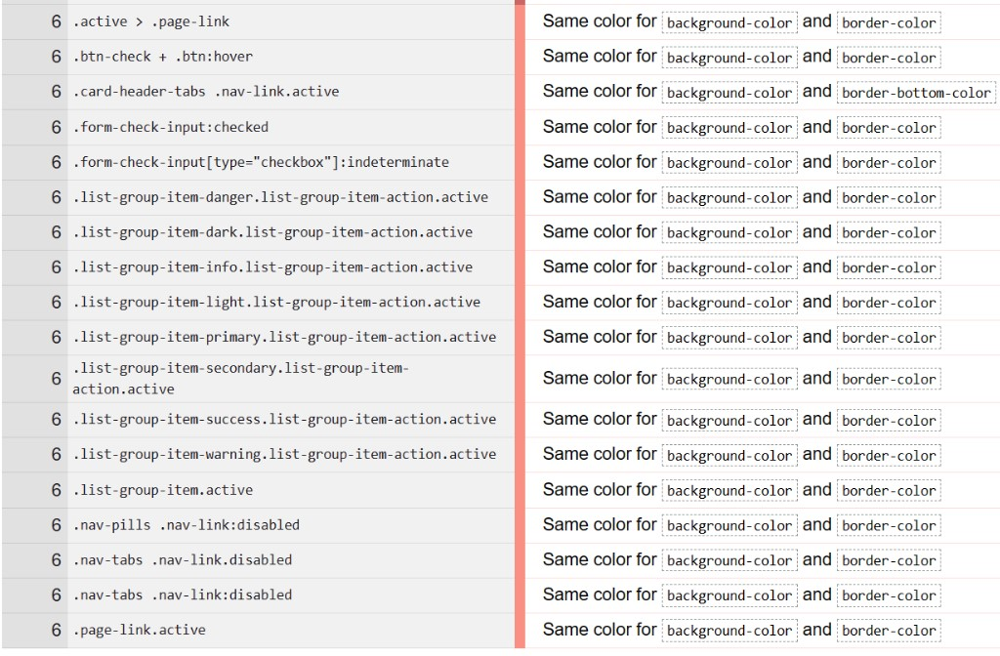</details>
   <hr>

## Accessibility
Accessibility has been a priority throughout the development process. The project has been tested using various tools and manual checks to ensure it complies with accessibility standards, providing an inclusive experience for users with diverse needs.

## Wave Validation

The Wave Validation has been conducted, revealing zero errors and a few alerts. One of the alerts pertains to the visual presentation, suggesting potential issues with the visibility of headings in pink against a white background. However, user testing has shown no problems with readability or visibility, and we have chosen to disregard this alert. Additionally, a similar issue is observed on the diary page, where the pink date may encounter responsiveness challenges. Despite this, visual inspection and user testing confirm that the content is visible and accessible.

Another point raised in the validation is the similarity of link URLs, where many are relative and deemed similar. Given the ongoing development and redirection to a 404 page, these URLs remain as such for the time being. It's acknowledged that this might affect the Wave Validation but is considered in the context of the evolving project.

## Lighthouse Validation

Lighthouse Validation has played a pivotal role in shaping the development of our project. This invaluable tool has proven to be highly useful throughout the creation process. While we haven't achieved a high score in the PERFORMANCE category, other aspects have excelled, nearly reaching a perfect score. This outcome provides us with valuable insights into areas for improvement, particularly in optimizing image resolutions. Going forward, we aim to enhance the project by addressing the identified performance-related opportunities.


Please note that ongoing development may introduce variations that impact specific validations. We appreciate your understanding as we continue to enhance the Dreams Reader Project.


## Device Testing
The project has undergone testing on various devices, including desktops, laptops, tablets, and smartphones. This ensures responsiveness and functionality across different screen sizes and resolutions.

<details><summary><b>Desktop Testing</b></summary>
   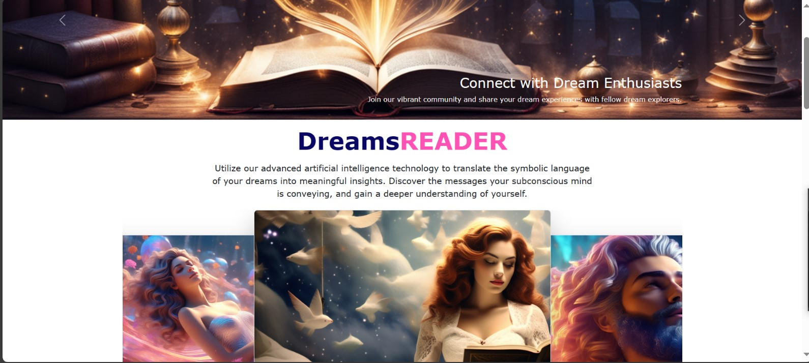</details>
   <hr>

<details><summary><b>Tablet Testing</b></summary>
   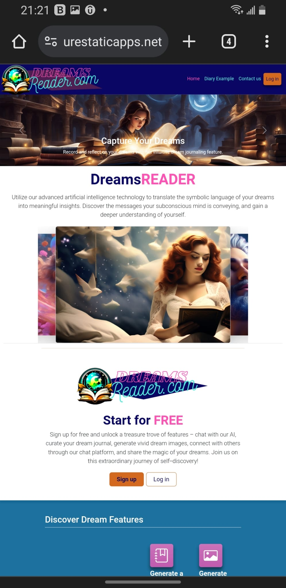</details>
   <hr>

<details><summary><b>Mobile Testing</b></summary>
   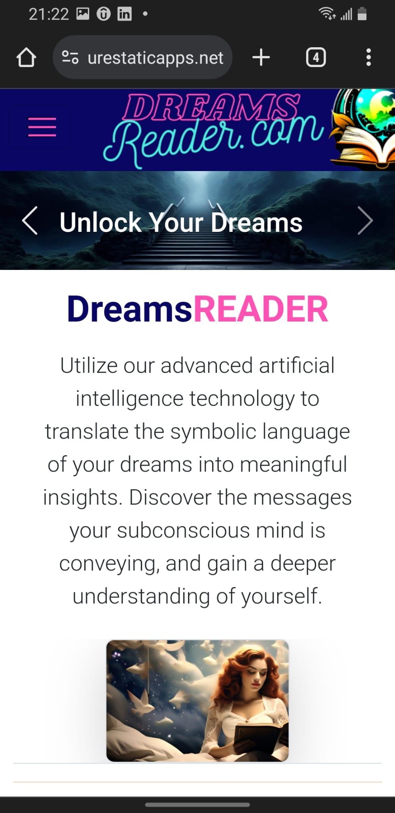</details>
   <hr>

## Browser Compatibility
<details><summary><b>Edge,Firefox,Chrome</b></summary>
   
   </details>
   <hr>
Extensive testing has been conducted on multiple browsers, including but not limited to Chrome, Firefox, Safari, and Microsoft Edge. The project aims for consistent performance and appearance across these popular browsers.

### *Special Attention to Dark Mode:*
<details><summary><b>Mobile DARK MODE</b></summary>
   
   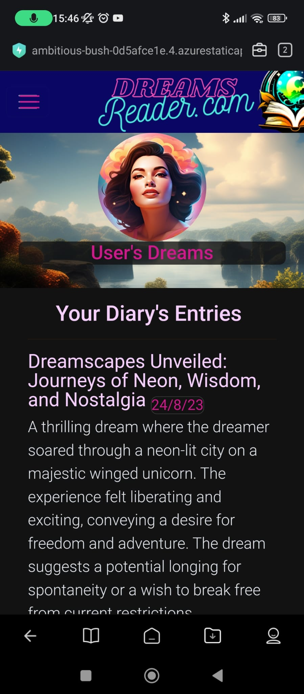
   </details>
   <hr>

# User Stories Testing

While testing on various devices, the project's compatibility with dark mode has been specifically examined. Notably, the Xiaomi browser, with dark mode activated, showcases the project's adaptability, providing an optimal experience for users in dark mode.

**First-time User**

1. **Introduction Clarity:**
   | **Feature** | **Action** | **Expected Result** | **Actual Result** |
   |-------------|------------|---------------------|-------------------|
   | Platform Introduction | Visit the home page and read introductory content | Clear understanding of the platform's purpose | Works as expected |

2. **User-Friendly Navigation:**
   | **Feature** | **Action** | **Expected Result** | **Actual Result** |
   |-------------|------------|---------------------|-------------------|
   | Navigation System | Explore different sections using the navigation bar | Intuitive navigation experience | Works as expected |

3. **Engaging Content:**
   | **Feature** | **Action** | **Expected Result** | **Actual Result** |
   |-------------|------------|---------------------|-------------------|
   | Explore Dream Entries | Navigate to dream entries and explore content | Engaging and interesting dream entries | Works as expected |

4. **Value Proposition:**
   | **Feature** | **Action** | **Expected Result** | **Actual Result** |
   |-------------|------------|---------------------|-------------------|
   | Recognize Unique Value | Identify elements showcasing the platform's unique value | Clear understanding of Dream Reader's value | Works as expected |

**Returning User**

1. **Contact Details:**
   | **Feature** | **Action** | **Expected Result** | **Actual Result** |
   |-------------|------------|---------------------|-------------------|
   | Access Contact Information | Find and use provided contact details | Easily accessible contact form | Works as expected |

2. **Discover New Content:**
   | **Feature** | **Action** | **Expected Result** | **Actual Result** |
   |-------------|------------|---------------------|-------------------|
   | Explore New Entries | Navigate and discover new dream entries or features | New and engaging content visible on user's page | Works as expected |

3. **Social Media Presence:**
   | **Feature** | **Action** | **Expected Result** | **Actual Result** |
   |-------------|------------|---------------------|-------------------|
   | Find Social Media Links | Locate links to Dream Reader's social media | Easy access to social media platforms for updates | Works as expected |

4. **Interaction Opportunities:**
   | **Feature** | **Action** | **Expected Result** | **Actual Result** |
   |-------------|------------|---------------------|-------------------|
   | Engage with Community | Participate in community interactions | Ability to engage with the community and staff | Not Working yet |

**Site Owner**

1. **Mission Communication:**
   | **Feature** | **Action** | **Expected Result** | **Actual Result** |
   |-------------|------------|---------------------|-------------------|
   | Communicate Mission | Ensure users swiftly understand the mission | Clear and concise communication of Dream Reader's mission | Works as expected |

2. **Value Proposition Clarity:**
   | **Feature** | **Action** | **Expected Result** | **Actual Result** |
   |-------------|------------|---------------------|-------------------|
   | Clarify Value Proposition | Convey the specific value of Dream Reader | Users understand the unique value proposition | Works as expected |

3. **Advocacy for Dream Exploration:**
   | **Feature** | **Action** | **Expected Result** | **Actual Result** |
   |-------------|------------|---------------------|-------------------|
   | Spread Awareness | Advocate for dream exploration | Effective spread of awareness about dream exploration | Works as expected |

4. **Item Acquisition:**
   | **Feature** | **Action** | **Expected Result** | **Actual Result** |
   |-------------|------------|---------------------|-------------------|
   | Acquire Dream-Related Content | Work on acquiring more dream-related content | Successful acquisition of diverse dream entries | Ongoing |

5. **User Accessibility:**
   | **Feature** | **Action** | **Expected Result** | **Actual Result** |
   |-------------|------------|---------------------|-------------------|
   | Ensure Accessibility | Guarantee users can easily contact Dream Reader | Users can easily reach out through the contact form | Works as expected |

6. **AI Interpretation Focus:**
   | **Feature** | **Action** | **Expected Result** | **Actual Result** |
   |-------------|------------|---------------------|-------------------|
   | AI Interpretation Scope | Collaborate with Andryu Schittone to emphasize that the AI's primary role is dream interpretation | The AI system generates insightful and relevant dream interpretations without deviating from its core function | Not Working yet |

# Collaborative Efforts

The Dream Reader Project involves collaboration with [Andryu Schittone](https://www.linkedin.com/in/anschittone), who is focused on developing an AI system for dream interpretation. This collaborative effort separates responsibilities, with [Andryu Schittone](https://www.linkedin.com/in/anschittone) working on the AI component, while the frontend development is handled independently.

## Current State and Future Plans

### Current State

As of now, the Dream Reader Project is in its early stages, serving as a prototype to showcase the vision for the future. The project consists of three main static pages: the Index, an Example Diary, and a Contact Us page. Each page is designed with simplicity and user engagement in mind, providing a glimpse into the potential functionality of the platform.

1. **The index page:** introduces users to the project, offering information about Dream Reader and encouraging them to register or log in for a free account. It highlights the features of the platform, including the ability to create a personal diary, generate dream images, and contribute to a dream database. The community aspect is emphasized, allowing users to share their dreams and interact with others.

2. **The example diary page:** illustrates how a user's dream diary might look, featuring dream entries with titles, dates, explanations, attributes, and dream images. It also showcases the latest community posts in a slider format, encouraging users to explore and engage with shared dreams.

3. **The contact us page:** provides users with a means to reach out for support, collaboration, or to provide feedback. It features a simple form for users to fill out with their name, email, and message.

### Future Plans

The Dream Reader Project is a work in progress with a roadmap for future enhancements:

1. **Implementation of Dream Interpretation AI:** Collaborating with a friend, [Andryu Schittone](https://www.linkedin.com/in/anschittone), who is working on training an AI and creating a neural network. The goal is to implement an AI capable of reading and interpreting dreams, generating insightful posts based on user input.

2. **Enhanced Diary Features:** Development of features allowing users to access detailed conversations with the AI, providing summaries of dreams, and facilitating a richer diary experience.

3. **Community Engagement:** Expanding community features, allowing users to comment on and rate each other's dream entries. Encouraging active participation, collaboration, and a sense of community within the platform.

4. **Refined User Interface and Experience:** Continual improvements to the UI/UX based on user feedback and testing. Ensuring a seamless and enjoyable experience for users navigating the platform.

5. **Legal and Ethical Considerations:** Addressing legal and ethical aspects associated with using an AI to interpret dreams. Implementing policies to safeguard user data, privacy, and responsible use of the platform.

These future plans represent the direction in which the Dream Reader Project aims to evolve. The collaboration with Andrew on the AI component is a pivotal step towards making dream interpretation a reality on the platform.


## Deployment

The Dream Reader Project is deployed on Microsoft Azure, utilizing Azure App Service for hosting. The deployment process involves the following steps:

### Azure Deployment Process

1. **Azure Account:**
   - Ensure you have an active Microsoft Azure account. If not, you can [create a free account](https://azure.microsoft.com/en-us/free/).

2. **Azure App Service:**
   - Set up an Azure App Service to host the Dream Reader Project.
     - Navigate to the [Azure Portal](https://portal.azure.com/).
     - Click on "Create a resource" and search for "App Service."
     - Follow the prompts to create a new App Service, choosing the appropriate settings.

3. **Deployment from GitHub:**
   - In the Azure Portal, navigate to your newly created App Service.
   - Under the "Deployment" section, choose "Deployment Center."
   - Connect your App Service to your GitHub repository and configure the deployment options.
   - Trigger a manual deployment or set up automatic deployments from your GitHub repository.

4. **Azure Database (Future Enhancement):**
   - As part of future plans, the project aims to incorporate Azure Database for data storage and retrieval.

### Local Deployment

If you prefer local deployment, follow these steps:

1. **Clone the Repository:**
   - Clone the GitHub repository to your local machine using the following command:
     ```bash
     git clone https://github.com/Vgarcan/prj002.git
     ```

2. **Navigate to the Project Folder:**
   - Open a terminal or command prompt and navigate to the folder containing the downloaded project files:
     ```bash
     cd prj002
     ```

3. **Open HTML Files:**
   - Open the HTML files using your preferred web browser. You can do this by double-clicking on the 'index.html' file or using the browser's "Open File" option.

4. **Explore the Project:**
   - You can now explore the Dream Reader Project locally on your machine. Use the navigation bar and footer links to move between different pages.

Please note that the project is currently in the example stage, and certain features, such as AI-generated dream interpretation, are not yet functional. Future updates will enhance the project's capabilities.

For any inquiries or issues, feel free to use the contact form on the 'Contact Us' page.


# License

The Dream Reader Project is protected under the Creative Commons License to ensure responsible sharing and usage. The specifics of the license are as follows:

- **Attribution-NonCommercial-NoDerivs 3.0 Unported (CC BY-NC-ND 3.0):**
  - You are free to:
    - Share: Copy and redistribute the material in any medium or format.
  - Under the following terms:
    - **Attribution:** You must give appropriate credit, provide a link to the license, and indicate if changes were made. You may do so in any reasonable manner, but not in any way that suggests the licensor endorses you or your use.
    - **NonCommercial:** You may not use the material for commercial purposes.
    - **NoDerivatives:** If you remix, transform, or build upon the material, you may not distribute the modified material.

For a full copy of the license, please visit [Creative Commons Attribution-NonCommercial-NoDerivs 3.0 Unported License](https://creativecommons.org/licenses/by-nc-nd/3.0/).

By accessing and using the Dream Reader Project, you agree to abide by the terms and conditions set forth by this license.

Thank you for respecting the project's creative work and intellectual property.


# Bugs and Challenges

While developing the Dream Reader Project, I encountered several challenges and bugs, particularly when working with Bootstrap and validating CSS. Here's an overview of the issues faced and how they were addressed:

## Bootstrap Challenges

### Validation Issues:
During the development process, I noticed that Bootstrap's classes and components sometimes triggered validation errors when using a CSS validator. These issues included unrecognized properties, invalid values, or unknown pseudo-classes.

### Overcoming Validation Errors:
To address validation errors, I adopted the following strategies:

1. **Selective Validation:**
   - As Bootstrap is a widely-used framework, some of its classes may not be recognized by CSS validators. Rather than attempting to address every validation error, I opted for selective validation, focusing on critical aspects of the project.

2. **Ignore Known Issues:**
   - Some validation errors were related to Bootstrap's dynamic styles or browser-specific properties. Understanding these nuances, I chose to ignore certain known issues that didn't impact the project's functionality or appearance.

3. **Validation Explanations:**
   - In the project documentation, I included a section explaining that certain validation errors were expected due to the use of Bootstrap. This helps users understand the reasons behind the errors and assures them that the project adheres to best practices where possible.

## CSS Validation

### Bootstrap-Specific Classes:
Bootstrap's extensive set of classes introduces non-standard attributes that may not pass standard CSS validation. This is due to the dynamic nature of Bootstrap's styling.

### Workarounds:
To manage CSS validation challenges related to Bootstrap, I implemented the following workarounds:

1. **Manual Validation Review:**
   - After applying Bootstrap classes, I manually reviewed the validation results to differentiate between Bootstrap-related errors and genuine issues in the project's custom styles.

2. **Custom Styles Organization:**
   - I organized custom styles separate from Bootstrap styles where possible, allowing for a more focused review of potential validation errors.

3. **Documentation Clarity:**
   - In the project's documentation, I provided clarity on the use of Bootstrap and acknowledged that validation errors might occur due to its unique styling approach.

## Font Selection Challenge

Exploring alternative fonts led us to the realization that our current font choice not only complements our desired aesthetic but also performs exceptionally well across various browsers and devices. Despite attempts to experiment with different fonts, none surpassed the qualities of our current font.

### **Resolution:**

After thorough testing and assessment, I made a deliberate decision to maintain the existing font. Its visual appeal and consistent performance across platforms align with our project's identity, emphasizing a user-centric approach to ensure a positive experience.

## GitHub Deployment Issue:
During deployment on GitHub Pages, we encountered an issue where the image "banner4.png" on "diary.html" failed to load. This issue appears to be specific to GitHub deployment, as the image is accessible via its direct URL [here](https://vgarcan.github.io/prj002/assets/img/banners/banner4.png). This discrepancy suggests a potential error in the deployment process on GitHub. To ensure a seamless experience, we recommend accessing the project on [Azure](https://ambitious-bush-0d5afce1e.4.azurestaticapps.net/).

# Acknowledgment

I extend my appreciation to the following sources that influenced the structure and content of the Dream Reader Project:

## README.md Model

The README.md format employed for the Dream Reader Project is inspired by the exemplary work of Gianluca Zimmatore (Altera Musica Project). Drawing inspiration from a well-executed model that garnered high praise, I aimed to craft a README.md that meets the expected standards set by Code Institute.

## Bootstrap

The Dream Reader Project leverages Bootstrap as a foundation for its design. Utilizing Bootstrap's templates and features has facilitated a cleaner and more organized codebase, providing a solid starting point for customization.

## Content Contributions

The text-content for the 'Press' and 'Contact Us' pages has been generously provided by [Andryu Schittone](https://www.linkedin.com/in/anschittone). His contributions have enhanced the realism and functionality of these pages, contributing to a more immersive user experience.

## Playground.ai - Image Creation

We express gratitude to [playground.com](https://playground.com/) for providing an invaluable AI tool that aids in creating copyright-free images for our website. This tool ensures that our visuals comply with copyright regulations.

I express gratitude for the collaborative efforts that have enriched the Dreams Reader Project.
